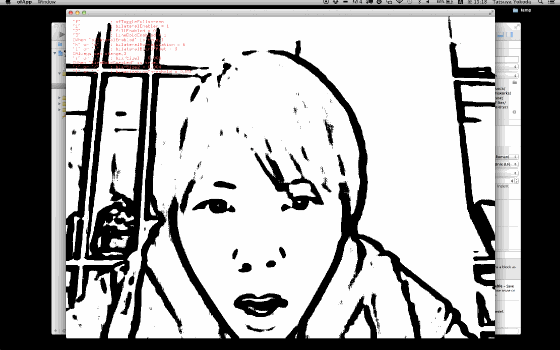
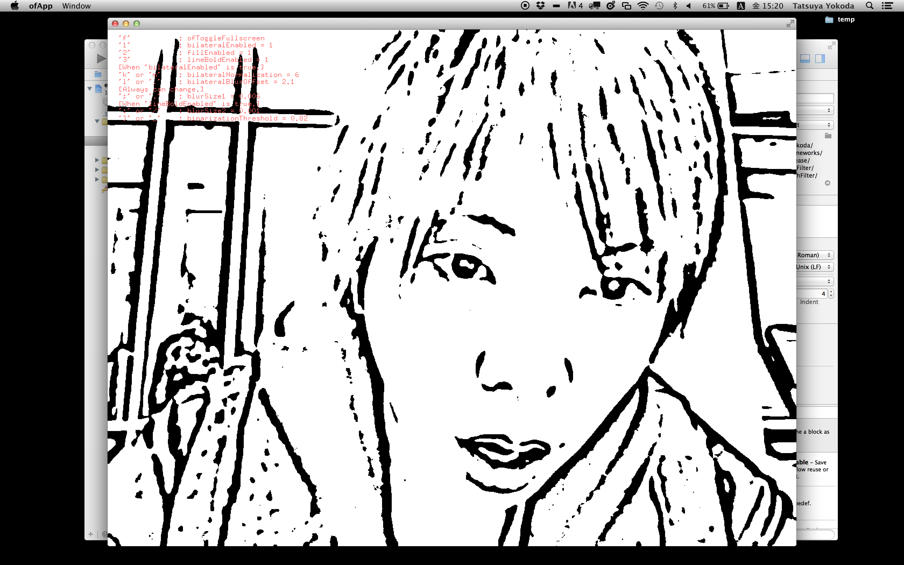
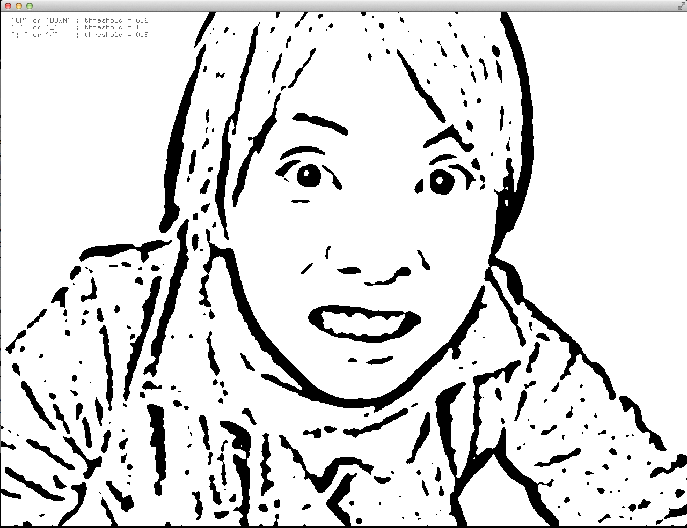
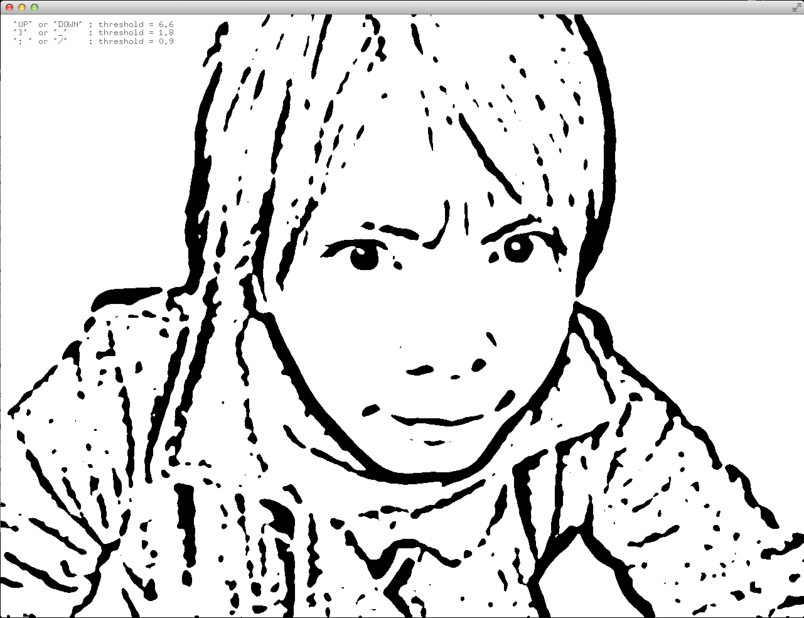
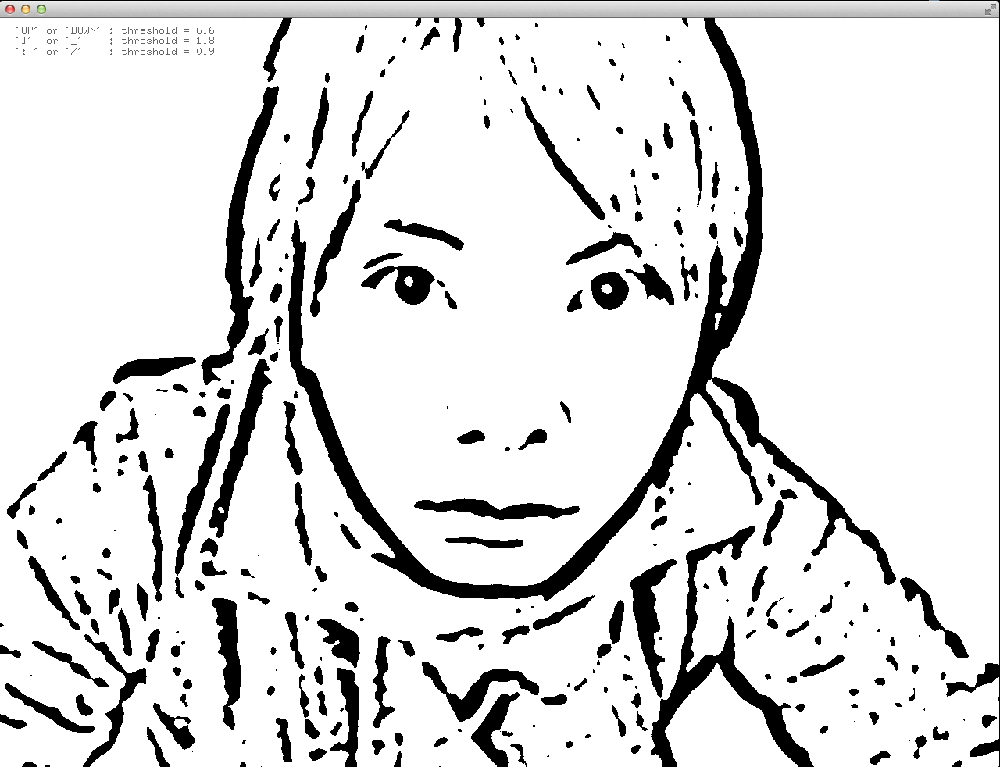
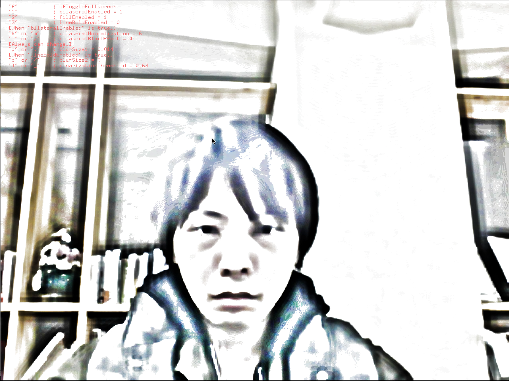

# ofxSketchFilter

[Vimeo]
https://vimeo.com/118887790

[Blog]
http://labs.1-10.com/blog/ofxSketchFilter.html (Coming soon)

Description:
--------

This is an addon that can apply like a sketch effect.
When you use the addon, copy `data/shaders` folder to your `openFrameworks/bin/data` folder.

Requirements
--------

Features:
--------

Updates:
--------

